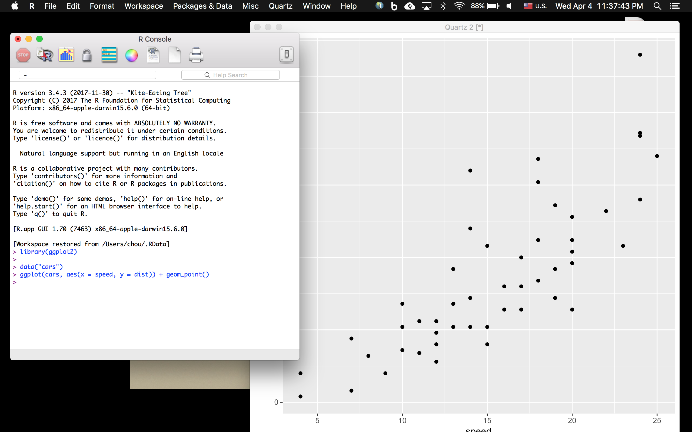
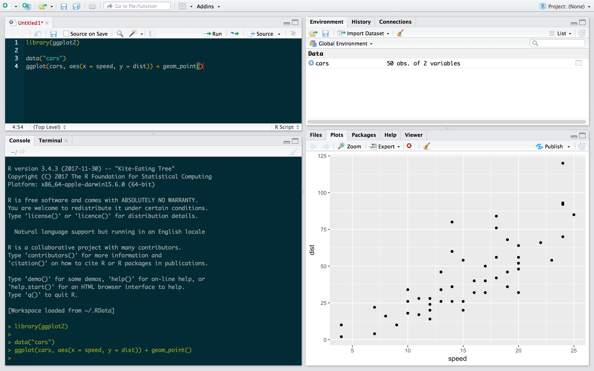
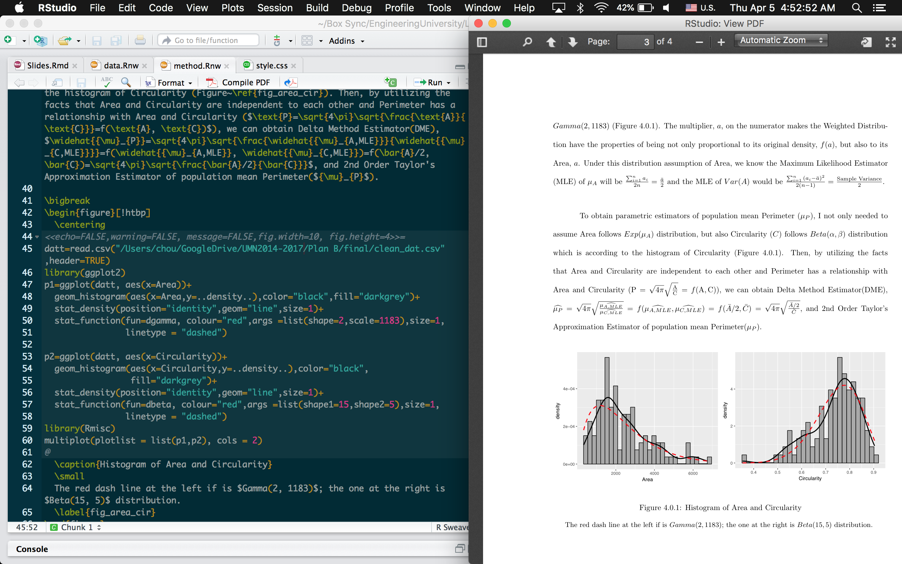

<script src="https://ajax.googleapis.com/ajax/libs/jquery/3.1.1/jquery.min.js"></script>
<script type="text/javascript">
  $(document).ready(function() {
    $('slides').prepend("<div class=\"zoomDiv\"></div>");
    // onClick function for all plots (img's)
    $('img:not(.zoomImg)').click(function() {
      $('.zoomImg').attr('src', $(this).attr('src'));
      $('.zoomDiv').css({opacity: '1', width: '80%'});
    });
    // onClick function for zoomImg
    $('img.zoomImg').click(function() {
      $('.zoomDiv').css({opacity: '0', width: '0%'});
    });
  });
</script>


```{r setup, include=FALSE}
knitr::opts_chunk$set(echo = FALSE)
```

## R VS. RStudio
R                          |  RStudio
:-------------------------:|:-------------------------:
  | 

## Hadley Wickham (Chief Scientist at RStudio)
<br />
<blockquote>
“The analyses that get me excited are not Google crunching a terabyte of web ad data in order to optimize revenue… [but rather] <br />
the biologists who are absolutely passionate about this one swampfly and now they can use R and they can understand it.“ 
</blockquote>

## Packages 
<center>
 
</center>

## R Markdwon -- Markdown
<center>
 
</center>

## R Sweave -- LaTex 
<center>
 
</center>

## Instruction -- Beautiful Cheatsheet
<iframe src="resources/cheatsheet.html" frameborder="0" scrolling="yes" style="height:500px;width:1000px;" ></iframe>

## Instruction -- Source Code
<center>
 
</center>

## Instruction -- Free Books
<iframe src="resources/book/index.html" frameborder="0" scrolling="yes" style="height:500px;width:1000px;" ></iframe>

